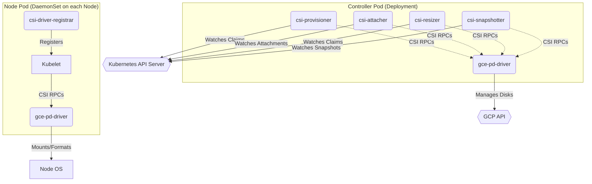

# GCE PD CSI Driver - Deployment Architecture

This document describes the Kubernetes components that make up the GCE Persistent Disk CSI Driver deployment.

## Overview

The driver is deployed in two main parts:

1.  **Controller Plugin:** A Deployment running a single replica, responsible for volume lifecycle operations that are not node-specific (e.g., Create/Delete Volume, Attach/Detach, Snapshots).
2.  **Node Plugin:** A DaemonSet ensuring an instance of the driver runs on every node in the cluster, responsible for node-specific operations (e.g., Stage/Unstage, Mount/Unmount).

## Controller Components

Runs as a Deployment named `csi-gce-pd-controller`.

*   **Containers:**
    *   **`gce-pd-driver`**: Implements the CSI Controller services. Communicates with the GCP API to manage Persistent Disks.
    *   **`csi-provisioner`**: Sidecar that watches for `PersistentVolumeClaim` objects and invokes the driver to create or delete volumes.
    *   **`csi-attacher`**: Sidecar that watches for `VolumeAttachment` objects and invokes the driver to attach or detach volumes from nodes.
    *   **`csi-resizer`**: Sidecar that watches for `PersistentVolumeClaim` size changes and invokes the driver to expand volumes.
    *   **`csi-snapshotter`**: Sidecar that watches for `VolumeSnapshotContent` objects and invokes the driver to create or delete disk snapshots.
*   **Communication:** Sidecars communicate with the `gce-pd-driver` via a shared Unix Domain Socket (`/csi/csi.sock`).
*   **Scope:** Typically runs on Linux control plane or worker nodes.

## Node Components

Runs as a DaemonSet named `csi-gce-pd-node` (separate versions for Linux and Windows).

*   **Containers (Linux Example):**
    *   **`gce-pd-driver`**: Implements the CSI Node services. Interacts with the node's OS to mount/unmount volumes, format filesystems, etc.
    *   **`csi-driver-registrar`**: Sidecar that registers the driver with the Kubelet on each node, making it aware of the driver's socket.
*   **Privileges:** Requires privileged access to interact with devices and mount points on the host.
*   **Host Mounts:** Mounts various host paths, including `/dev`, `/sys`, `/var/lib/kubelet/pods`, etc.
*   **Scope:** Runs on every node where Persistent Disk volumes need to be managed.

## Diagram

