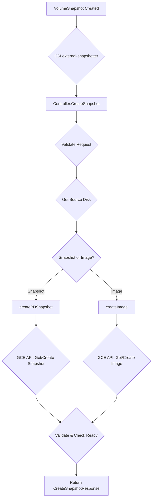

[Sourced from: pkg/gce-pd-csi-driver/controller.go](file:///usr/local/google/home/jaimebz/oss/gcp-compute-persistent-disk-csi-driver/pkg/gce-pd-csi-driver/controller.go)

# CSI ControllerCreateSnapshot

## RPC Definition

```protobuf
rpc CreateSnapshot (CreateSnapshotRequest) returns (CreateSnapshotResponse) {}
```

## Purpose

This operation is called by the CSI external-snapshotter sidecar to create a snapshot of a Persistent Disk (PD) volume.

*   **Trigger:** Creation of a `VolumeSnapshot` object in Kubernetes.
*   **Action:** Calls the GCE API to create a new GCE Snapshot or GCE Image from the specified PD.
*   **Kubernetes Outcome:** A `VolumeSnapshotContent` object is created and bound to the `VolumeSnapshot`.

## Parameters

*   `source_volume_id`: The ID of the volume to snapshot. (Required)
*   `name`: The name to give to the snapshot. (Required)
*   `parameters`: Specifies the type of backup to create (GCE Snapshot or Image) and other options like storage locations, labels, and tags.
    *   `snapshot-type`: `snapshot` (default) or `image`.

## Key Logic Flow

1.  **Validate Arguments:** Checks for `source_volume_id` and `name`.
2.  **Parse Volume ID:** Validates and parses the `source_volume_id`.
3.  **Multi-Zone Check:** Rejects snapshot creation for multi-zone volumes.
4.  **Acquire Lock:** Locks the volume ID to prevent concurrent operations.
5.  **Get Disk:** Verifies the source PD exists.
6.  **Extract Parameters:** Parses snapshot parameters, determining if it's a Snapshot or Image creation.
7.  **Dispatch Creation:**
    *   If `snapshot-type` is `snapshot`: Calls `createPDSnapshot`.
    *   If `snapshot-type` is `image`: Calls `createImage`. Rejects if the source disk is regional.
8.  **`createPDSnapshot` / `createImage`:**
    *   Check if Snapshot/Image already exists with the given name.
    *   If Not Found, call GCE API to create the Snapshot/Image.
    *   Validate the existing or newly created Snapshot/Image against the source volume (`validateExistingSnapshot` / `validateExistingImage`).
    *   Parse creation timestamp.
    *   Check if the Snapshot/Image is ready (`isCSISnapshotReady` / `isImageReady`).
    *   Return a `csi.Snapshot` object.
9.  **Return Response:** Wraps the `csi.Snapshot` in `CreateSnapshotResponse`.



## Error Handling

*   `InvalidArgument`: Missing parameters, invalid volume ID, unsupported multi-zone snapshot, invalid snapshot type.
*   `NotFound`: Source volume not found.
*   `Aborted`: Concurrent operation lock.
*   `AlreadyExists`: Snapshot/Image with the same name exists but is incompatible.
*   Propagates GCE API errors.

## Return Values

*   `CreateSnapshotResponse`: Contains the `csi.Snapshot` object with details like `snapshot_id`, `source_volume_id`, `creation_time`, `ready_to_use`, and `size_bytes`.

---

[← README.md](./README.md)
