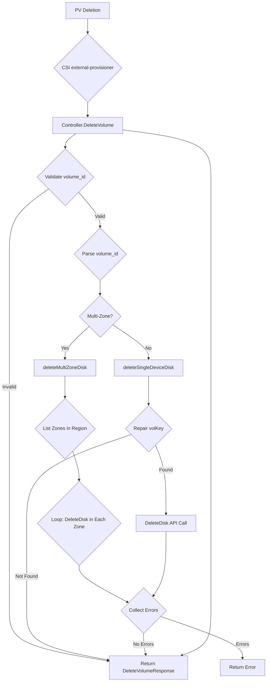

[Sourced from: pkg/gce-pd-csi-driver/controller.go](file:///usr/local/google/home/jaimebz/oss/gcp-compute-persistent-disk-csi-driver/pkg/gce-pd-csi-driver/controller.go)

# CSI ControllerDeleteVolume

## RPC Definition

```protobuf
rpc DeleteVolume (DeleteVolumeRequest) returns (DeleteVolumeResponse) {}
```

## Purpose

This operation is called by the CSI external-provisioner sidecar when the `PersistentVolume` (PV) object associated with a dynamically provisioned volume is deleted in Kubernetes. This typically happens when the `PersistentVolumeClaim` (PVC) bound to the PV is deleted and the PV's reclaim policy is set to `Delete`.

The driver's responsibility is to delete the underlying Google Cloud Persistent Disk (PD) volume.

*   **Trigger:** Deletion of a `PersistentVolume` object (usually triggered by PVC deletion with `Delete` reclaim policy).
*   **Action:** Calls the GCE API to delete the Persistent Disk.
*   **Kubernetes Outcome:** The underlying storage resource is removed. The PV object is already deleted or in the process of being deleted by Kubernetes.

## Parameters

*   `volume_id`: The unique identifier of the volume to be deleted, as returned by `CreateVolume`. This is required.

## Key Logic Flow

1.  **Validate Arguments:** Checks if the `volume_id` is provided.
2.  **Parse Volume ID:** Parses the `volume_id` to extract the project and volume key (name, zone/region).
3.  **Handle Invalid ID:** If the `volume_id` is malformed, it logs a warning and returns success, as per the CSI spec, as the volume can be considered already gone.
4.  **Multi-Zone Check:** Determines if the `volume_id` refers to a multi-zone setup.
5.  **Multi-Zone Deletion (`deleteMultiZoneDisk`):**
    *   Lists all possible zones in the region.
    *   Acquires a lock for the multi-zone volume ID.
    *   Iterates through each zone, constructing the zonal disk key.
    *   Calls GCE API `DeleteDisk` for each zonal disk.
    *   Collects any errors.
6.  **Single Device Deletion (`deleteSingleDeviceDisk`):**
    *   Repairs the volume key to ensure zone/region is fully specified.
    *   If the volume is not found during repair, returns success.
    *   Acquires a lock for the volume ID.
    *   Calls GCE API `DeleteDisk` for the zonal or regional disk.
7.  **Return Success:** Returns an empty `DeleteVolumeResponse` on successful deletion or if the volume was not found.



## Error Handling

*   Returns `InvalidArgument` if `volume_id` is missing.
*   Returns success if `volume_id` is malformed or the disk is not found, complying with CSI idempotency requirements.
*   Propagates errors from GCE API `DeleteDisk` calls.
*   Uses a locking mechanism (`volumeLocks`) to prevent concurrent operations on the same volume ID.

## Return Values

*   `DeleteVolumeResponse`: An empty response indicating success.

---

[← README.md](./README.md)
