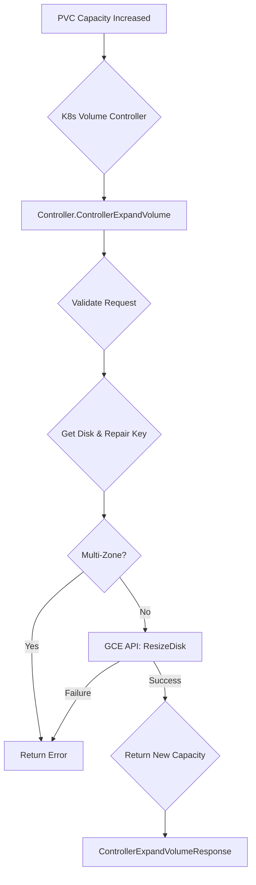

[Sourced from: pkg/gce-pd-csi-driver/controller.go](file:///usr/local/google/home/jaimebz/oss/gcp-compute-persistent-disk-csi-driver/pkg/gce-pd-csi-driver/controller.go)

# CSI ControllerExpandVolume

## RPC Definition

```protobuf
rpc ControllerExpandVolume (ControllerExpandVolumeRequest) returns (ControllerExpandVolumeResponse) {}
```

## Purpose

This operation is called by Kubernetes to increase the size of a Persistent Disk (PD) volume. This is usually triggered when a user modifies the capacity request in a `PersistentVolumeClaim` (PVC).

*   **Trigger:** User increases the size request in a PVC on a StorageClass that supports volume expansion.
*   **Action:** Calls the GCE API to resize the underlying PD.
*   **Kubernetes Outcome:** The `PersistentVolume` (PV) object capacity is updated. File system resizing on the node is typically required (indicated by `NodeExpansionRequired: true`).

## Parameters

*   `volume_id`: The ID of the volume to expand. (Required)
*   `capacity_range`: The new desired capacity. (Required)

## Key Logic Flow

1.  **Validate Arguments:** Checks for `volume_id` and a valid `capacity_range`.
2.  **Parse Volume ID:** Validates and parses the `volume_id`.
3.  **Repair Volume Key:** Ensures the volume key is fully specified.
4.  **Multi-Zone Check:** Rejects expansion for multi-zone volumes.
5.  **Get Disk:** Fetches the current disk details (for metrics).
6.  **Resize Disk:** Calls GCE API `ResizeDisk` with the new requested size in bytes.
7.  **Return Response:** Returns the new capacity and indicates that node-level expansion is necessary.



## Error Handling

*   `InvalidArgument`: Missing parameters, invalid volume ID, invalid capacity range, or attempt to expand a multi-zone volume.
*   `NotFound`: Source volume not found.
*   Propagates GCE API errors from the resize operation.

## Return Values

*   `ControllerExpandVolumeResponse`:
    *   `capacity_bytes`: The new size of the volume after expansion.
    *   `node_expansion_required`: Always `true`, as the file system on the node must also be resized.

---

[← README.md](./README.md)
