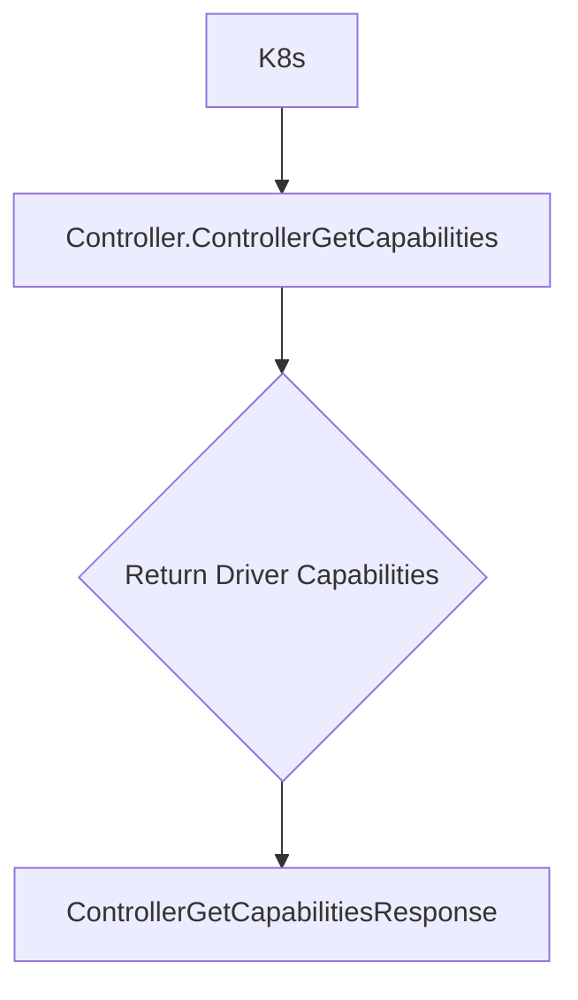

[Sourced from: pkg/gce-pd-csi-driver/controller.go](file:///usr/local/google/home/jaimebz/oss/gcp-compute-persistent-disk-csi-driver/pkg/gce-pd-csi-driver/controller.go)

# CSI ControllerGetCapabilities

## RPC Definition

```protobuf
rpc ControllerGetCapabilities (ControllerGetCapabilitiesRequest) returns (ControllerGetCapabilitiesResponse) {}
```

## Purpose

This operation allows Kubernetes to discover the optional features the Controller service of this CSI driver supports.

*   **Trigger:** Called by Kubernetes on driver startup and potentially at other times.
*   **Action:** Returns a predefined list of supported Controller service capabilities.

## Parameters

None.

## Key Logic Flow

1.  The function returns a `ControllerGetCapabilitiesResponse` containing the capabilities stored in `gceCS.Driver.cscap`.



## Supported Capabilities

The specific capabilities are initialized in the `Driver` struct. Common capabilities include:

*   `CREATE_DELETE_VOLUME`
*   `PUBLISH_UNPUBLISH_VOLUME`
*   `LIST_VOLUMES`
*   `EXPAND_VOLUME`
*   `CREATE_DELETE_SNAPSHOT`
*   `LIST_SNAPSHOTS`
*   `CLONE_VOLUME`

To see the exact list, check the initialization of the `GCEPDDriver` object.

---

[← README.md](./README.md)
