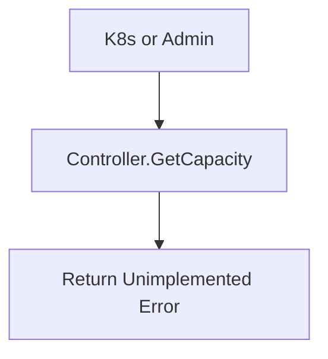

[Sourced from: pkg/gce-pd-csi-driver/controller.go](file:///usr/local/google/home/jaimebz/oss/gcp-compute-persistent-disk-csi-driver/pkg/gce-pd-csi-driver/controller.go)

# CSI ControllerGetCapacity

## RPC Definition

```protobuf
rpc GetCapacity (GetCapacityRequest) returns (GetCapacityResponse) {}
```

## Purpose

This operation is intended to return the available capacity of the storage pool. However, it is currently **not implemented** in this CSI driver.

*   **Trigger:** Called by Kubernetes or external a dmin tools.
*   **Action:** Returns an `Unimplemented` error.

## Parameters

*   `volume_capabilities`: Capabilities to consider for capacity.
*   `parameters`: StorageClass parameters.
*   `accessible_topology`: Topology to consider for capacity.

## Key Logic Flow

1.  The function immediately returns an `Unimplemented` error code.



---

[← README.md](./README.md)
