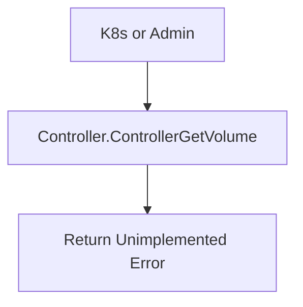

[Sourced from: pkg/gce-pd-csi-driver/controller.go](file:///usr/local/google/home/jaimebz/oss/gcp-compute-persistent-disk-csi-driver/pkg/gce-pd-csi-driver/controller.go)

# CSI ControllerGetVolume

## RPC Definition

```protobuf
rpc ControllerGetVolume (ControllerGetVolumeRequest) returns (ControllerGetVolumeResponse) {}
```

## Purpose

This operation is intended to return the current status of a volume. However, it is currently **not implemented** in this CSI driver, as indicated by the TODO comment and the function implementation.

*   **Trigger:** Called by Kubernetes or external tools.
*   **Action:** Returns an `Unimplemented` error.

## Parameters

*   `volume_id`: The ID of the volume to get. (Required)

## Key Logic Flow

1.  The function immediately returns an `Unimplemented` error code.



> [!NOTE]
> There is a TODO item (#809) to implement this feature and advertise the corresponding capability.

---

[← README.md](./README.md)
