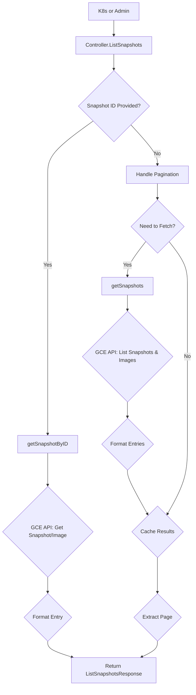

[Sourced from: pkg/gce-pd-csi-driver/controller.go](file:///usr/local/google/home/jaimebz/oss/gcp-compute-persistent-disk-csi-driver/pkg/gce-pd-csi-driver/controller.go)

# CSI ControllerListSnapshots

## RPC Definition

```protobuf
rpc ListSnapshots (ListSnapshotsRequest) returns (ListSnapshotsResponse) {}
```

## Purpose

This operation is called by the CSI external-snapshotter sidecar to list existing snapshots. It can list all snapshots or filter by a specific `snapshot_id` or `source_volume_id`.

*   **Trigger:** Called by Kubernetes or administrative tools.
*   **Action:** Fetches Snapshots and Images from the GCE API based on the request filters.

## Parameters

*   `max_entries`: Maximum number of entries per page.
*   `starting_token`: Pagination token.
*   `snapshot_id`: If provided, lists only the snapshot matching this ID.
*   `source_volume_id`: If provided, lists only snapshots created from this volume ID.

## Key Logic Flow

1.  **Specific Snapshot ID:** If `snapshot_id` is provided, call `getSnapshotByID`:
    *   Parse the ID to get project, type, and key.
    *   Call GCE API `GetSnapshot` or `GetImage`.
    *   Format the result using `generateDiskSnapshotEntry` or `generateDiskImageEntry`.
    *   Returns a single entry or empty list if not found.
2.  **General List:** If `snapshot_id` is not provided:
    *   Validate `max_entries`.
    *   Handle Pagination using `starting_token` and an in-memory cache (`gceCS.snapshots`, `gceCS.snapshotTokens`).
    *   If no token/cache, call `getSnapshots`:
        *   Construct a filter if `source_volume_id` is given.
        *   Call GCE API `ListSnapshots` and `ListImages`.
        *   Combine and format results using `generateDiskSnapshotEntry` and `generateDiskImageEntry`.
        *   Cache the full results.
    *   Return the paginated list.



## Helper Functions

*   `generateDiskSnapshotEntry`: Converts a GCE `compute.Snapshot` to a `csi.ListSnapshotsResponse_Entry`.
*   `generateDiskImageEntry`: Converts a GCE `compute.Image` to a `csi.ListSnapshotsResponse_Entry`.

## Return Values

*   `ListSnapshotsResponse`: Contains a list of `csi.Snapshot` entries and a `next_token` for pagination.

---

[← README.md](./README.md)
