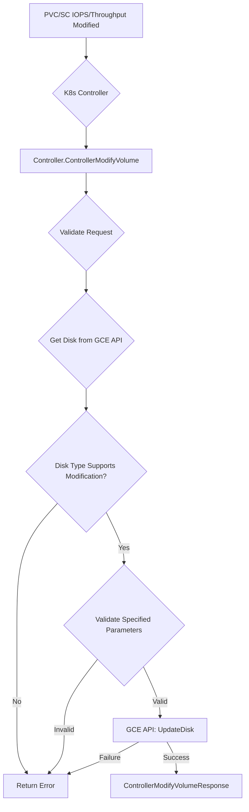

[Sourced from: pkg/gce-pd-csi-driver/controller.go](file:///usr/local/google/home/jaimebz/oss/gcp-compute-persistent-disk-csi-driver/pkg/gce-pd-csi-driver/controller.go)

# CSI ControllerModifyVolume

## RPC Definition

```protobuf
rpc ControllerModifyVolume (ControllerModifyVolumeRequest) returns (ControllerModifyVolumeResponse) {}
```

## Purpose

This operation is called by Kubernetes to modify volume attributes, specifically the provisioned IOPS and/or Throughput for supported Persistent Disk (PD) types (e.g., Hyperdisks).

*   **Trigger:** User modifies the IOPS or Throughput fields in a `PersistentVolumeClaim` or `StorageClass` for a volume type that supports dynamic provisioning.
*   **Action:** Calls the GCE API to update the disk's provisioned IOPS/Throughput.

## Parameters

*   `volume_id`: The ID of the volume to modify. (Required)
*   `mutable_parameters`: A map containing the parameters to modify. Key parameters include:
    *   `iops`: The new desired provisioned IOPS.
    *   `throughput`: The new desired provisioned Throughput in MiB/s.

## Key Logic Flow

1.  **Validate Arguments:** Checks for `volume_id`.
2.  **Parse Volume ID:** Validates and parses the `volume_id`.
3.  **Extract Mutable Parameters:** Parses `iops` and `throughput` from `mutable_parameters`.
4.  **Get Disk:** Fetches the current disk details from the GCE API.
5.  **Check Disk Type Support:** Verifies that the disk type supports dynamic IOPS/Throughput changes using `diskSupportsIopsChange` and `diskSupportsThroughputChange` helpers.
6.  **Validate Parameter Applicability:** Ensures IOPS is only specified if the disk type supports IOPS changes, and the same for Throughput.
7.  **Update Disk:** Calls GCE API `UpdateDisk` with the new IOPS/Throughput values.
8.  **Return Response:** Returns an empty `ControllerModifyVolumeResponse` on success.



## Error Handling

*   `InvalidArgument`: Missing `volume_id`, invalid mutable parameters, or attempting to modify non-supported disk types or parameters.
*   `NotFound`: If the disk specified by `volume_id` doesn't exist in GCE.
*   Propagates GCE API errors from the UpdateDisk operation.

## Return Values

*   `ControllerModifyVolumeResponse`: An empty response indicating success.

---

[← README.md](./README.md)
