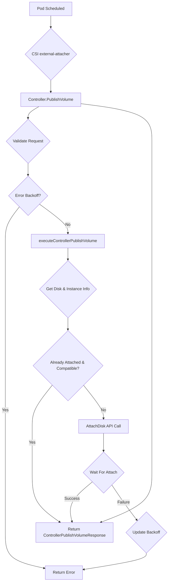

[Sourced from: pkg/gce-pd-csi-driver/controller.go](file:///usr/local/google/home/jaimebz/oss/gcp-compute-persistent-disk-csi-driver/pkg/gce-pd-csi-driver/controller.go)

# CSI ControllerPublishVolume

## RPC Definition

```protobuf
rpc ControllerPublishVolume (ControllerPublishVolumeRequest) returns (ControllerPublishVolumeResponse) {}
```

## Purpose

This operation is called by the CSI external-attacher sidecar. Its purpose is to make a Persistent Disk (PD) volume available to a specific node. In the context of GCE, this means attaching the PD to the Google Compute Engine Virtual Machine instance corresponding to the Kubernetes node.

*   **Trigger:** A Pod is scheduled on a node, and the Pod references a `PersistentVolumeClaim` bound to a PV managed by this CSI driver.
*   **Action:** Calls the GCE API to attach the specified PD to the target VM instance.
*   **Kubernetes Outcome:** The `VolumeAttachment` object in Kubernetes is updated, and the PD becomes visible to the Kubelet on the node, allowing it to proceed with the `NodeStageVolume` and `NodePublishVolume` steps.

## Parameters

*   `volume_id`: The unique identifier of the volume (PD) to attach. (Required)
*   `node_id`: The identifier of the node (VM instance) to attach the volume to. (Required)
*   `volume_capability`: The access mode and type required for the volume. (Required)
*   `readonly`: Whether the volume should be attached as read-only.
*   `volume_context`: Additional parameters, potentially including `force-attach`.

## Key Logic Flow

1.  **Validation (`validateControllerPublishVolumeRequest`):**
    *   Ensures `volume_id`, `node_id`, and `volume_capability` are provided.
    *   Parses `volume_id` to get the project and volume key.
    *   Validates the `volume_capability`.
    *   Extracts any `PDCSIContext` from `volume_context` (e.g., `force-attach`).
2.  **Error Backoff:** Checks if there's an active backoff for this volume/node pair due to previous errors.
3.  **Execution (`executeControllerPublishVolume`):**
    *   Parses `node_id` to get the instance zone and name.
    *   Handles Multi-Zone volumes: Validates read-only and converts volume key to the specific instance zone.
    *   Repairs Volume Key: Ensures the volume key is fully specified.
    *   Acquires Lock: Prevents concurrent publish operations for the same volume on the same node.
    *   Get Disk & Instance: Fetches the PD and VM instance details from GCE API.
    *   Compatibility Check: Verifies if the disk is already attached to the instance and if the existing attachment is compatible with the request (e.g., read-only status).
    *   Already Attached: If compatibly attached, returns success.
    *   Update Access Mode: If necessary (e.g., Hyperdisk ML), updates the disk's access mode via GCE API.
    *   Attach Disk: Calls GCE API `AttachDisk` to attach the PD to the VM.
    *   Wait For Attach: Waits for the attach operation to complete.
4.  **Update Backoff:** Clears or updates the error backoff state based on the result.
5.  **Return Response:** Returns `ControllerPublishVolumeResponse` (usually empty publish context for this driver).



## Supported Features

*   Attaching zonal and regional PDs.
*   Read-only attachments.
*   Force attach (if specified in volume context).
*   Handles multi-zone volumes by attaching the specific zonal disk corresponding to the node's zone.
*   Hyperdisk access mode updates where applicable.

## Error Handling

*   `InvalidArgument`: Missing or malformed `volume_id`, `node_id`, or `volume_capability`.
*   `NotFound`: If the specified volume or node (instance) cannot be found in GCE.
*   `Aborted`: If a concurrent operation is in progress for the same volume and node, or due to error backoff.
*   `AlreadyExists`: If the disk is already attached but with incompatible settings.
*   Propagates errors from GCE API calls (e.g., attach failures due to limits or permissions).

## Return Values

*   `ControllerPublishVolumeResponse`: Typically contains an empty `publish_context` map, as device path information is handled at the node level.

---

[← README.md](./README.md)
