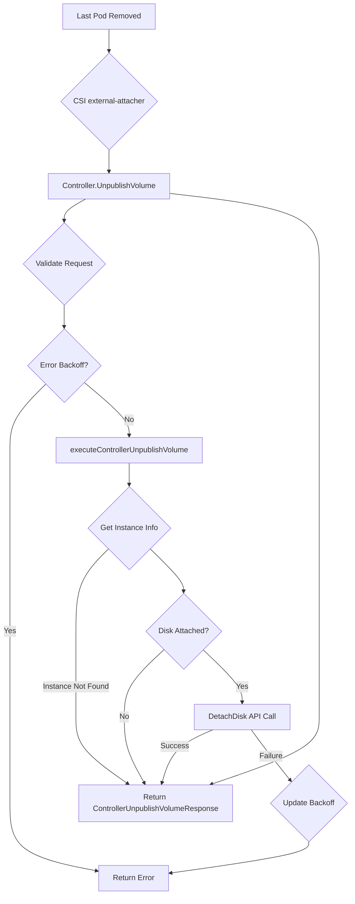

[Sourced from: pkg/gce-pd-csi-driver/controller.go](file:///usr/local/google/home/jaimebz/oss/gcp-compute-persistent-disk-csi-driver/pkg/gce-pd-csi-driver/controller.go)

# CSI ControllerUnpublishVolume

## RPC Definition

```protobuf
rpc ControllerUnpublishVolume (ControllerUnpublishVolumeRequest) returns (ControllerUnpublishVolumeResponse) {}
```

## Purpose

This operation is called by the CSI external-attacher sidecar to detach a Persistent Disk (PD) volume from a specific node. This typically happens when the last Pod using the volume on that node is terminated or rescheduled elsewhere.

*   **Trigger:** Deletion of the `VolumeAttachment` object, usually resulting from no more Pods requiring the volume on the node.
*   **Action:** Calls the GCE API to detach the specified PD from the target VM instance.
*   **Kubernetes Outcome:** The PD is no longer attached to the node's VM. The `VolumeAttachment` object is deleted.

## Parameters

*   `volume_id`: The unique identifier of the volume (PD) to detach. (Required)
*   `node_id`: The identifier of the node (VM instance) from which to detach the volume. (Required)

## Key Logic Flow

1.  **Validation (`validateControllerUnpublishVolumeRequest`):**
    *   Ensures `volume_id` and `node_id` are provided.
    *   Parses `volume_id` to get the project and volume key.
2.  **Error Backoff:** Checks if there's an active backoff for this volume/node pair.
3.  **Execution (`executeControllerUnpublishVolume`):**
    *   Parses `node_id` to get the instance zone and name.
    *   Handles Multi-Zone volumes: Converts volume key to the specific instance zone.
    *   Repairs Volume Key: Ensures the volume key is fully specified. If not found, returns success (idempotency).
    *   Acquires Lock: Prevents concurrent unpublish operations for the same volume on the same node.
    *   Get Instance: Fetches the VM instance details from GCE API. If instance not found, returns success (disk is effectively detached).
    *   Check Attachment: Determines if the disk is currently attached to the instance.
    *   Not Attached: If not attached, returns success.
    *   Detach Disk: Calls GCE API `DetachDisk`.
4.  **Update Backoff:** Clears or updates the error backoff state based on the result.
5.  **Return Response:** Returns an empty `ControllerUnpublishVolumeResponse`.



## Error Handling

*   `InvalidArgument`: Missing or malformed `volume_id` or `node_id`.
*   `NotFound`: Returns success if the volume or instance is not found, as the desired state (detached) is met.
*   `Aborted`: If a concurrent operation is in progress or due to error backoff.
*   Propagates errors from GCE API calls.

## Return Values

*   `ControllerUnpublishVolumeResponse`: An empty response indicating success.

---

[← README.md](./README.md)
