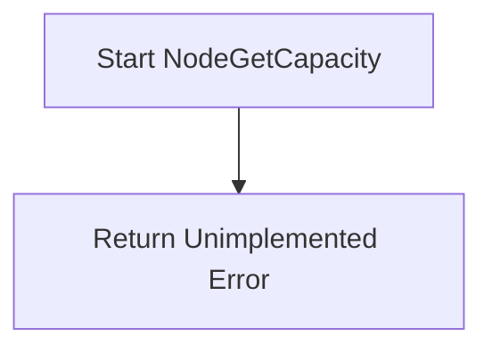

[Sourced from: pkg/gce-pd-csi-driver/node.go](file:///usr/local/google/home/jaimebz/oss/gcp-compute-persistent-disk-csi-driver/pkg/gce-pd-csi-driver/node.go#L734)

# CSI Operation: NodeGetCapacity

## RPC Definition
`rpc NodeGetCapacity(NodeGetCapacityRequest) returns (NodeGetCapacityResponse)`

## Purpose
Reports the capacity of the node. Not implemented by this driver.

## Key Logic Flow
1.  Returns Unimplemented error.

### Diagram

## Error Handling
*   `Unimplemented`
