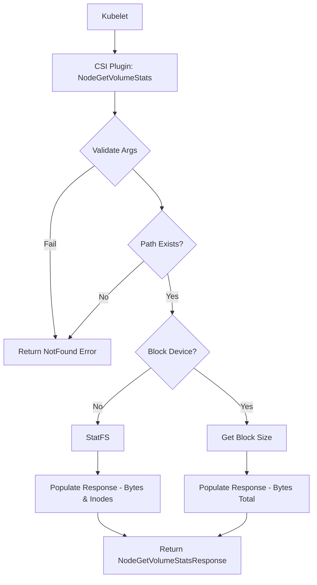

[Sourced from: pkg/gce-pd-csi-driver/node.go](file:///usr/local/google/home/jaimebz/oss/gcp-compute-persistent-disk-csi-driver/pkg/gce-pd-csi-driver/node.go)

# CSI NodeGetVolumeStats

## RPC Definition

```protobuf
rpc NodeGetVolumeStats (NodeGetVolumeStatsRequest) returns (NodeGetVolumeStatsResponse) {}
```

## Purpose

This operation is called by the Kubelet to get the current capacity and usage statistics of a volume that is mounted on the node.

*   **Trigger:** Kubelet periodically queries volume stats.
*   **Action:** Checks if the volume path exists and whether it's a block device or a mounted filesystem. Returns capacity, available space, and inode usage accordingly.

## Parameters

*   `volume_id`: The ID of the volume. (Required)
*   `volume_path`: The path on the node where the volume is accessible. (Required)

## Key Logic Flow

1.  **Validate Arguments:** Checks for `volume_id` and `volume_path`.
2.  **Check Path Existence:** Verifies that `volume_path` exists.
3.  **Determine Volume Type:** Checks if `volume_path` is a block device or a filesystem mount point.
4.  **Block Device:** If block, gets the total size of the block device using `getBlockSizeBytes`.
5.  **Filesystem:** If a mount point, uses `StatFS` to get bytes available, capacity, used, and inode statistics.
6.  **Return Response:** Populates `NodeGetVolumeStatsResponse` with the gathered usage statistics.



## Error Handling

*   `InvalidArgument`: Missing `volume_id` or `volume_path`.
*   `NotFound`: `volume_path` does not exist.
*   `Internal`: Errors during stat operations, block size retrieval, or StatFS.

## Return Values

*   `NodeGetVolumeStatsResponse`: Contains `VolumeUsage` metrics. For block devices, only total bytes are reported. For filesystems, bytes (available, total, used) and inodes (available, total, used) are reported.

---

[← README.md](./README.md)
