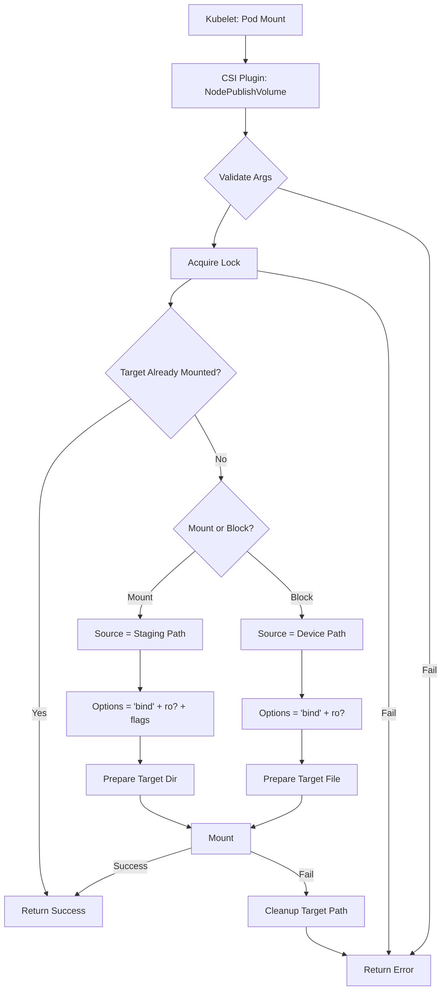

[Sourced from: pkg/gce-pd-csi-driver/node.go](file:///usr/local/google/home/jaimebz/oss/gcp-compute-persistent-disk-csi-driver/pkg/gce-pd-csi-driver/node.go)

# CSI NodePublishVolume

## RPC Definition

```protobuf
rpc NodePublishVolume (NodePublishVolumeRequest) returns (NodePublishVolumeResponse) {}
```

## Purpose

This operation is called by the Kubelet to make a staged volume available to a Pod. This typically involves bind mounting the volume from the staging path to the Pod's target path.

*   **Trigger:** When a Pod needs to mount the volume.
*   **Action:** Bind mounts the volume from `staging_target_path` to the Pod's `target_path`.

## Parameters

*   `volume_id`: The ID of the volume. (Required)
*   `staging_target_path`: The path where the volume is staged. (Required)
*   `target_path`: The path within the Pod's mount namespace to bind mount to. (Required)
*   `volume_capability`: Specifies the access type (Mount/Block) and mode. (Required)
*   `readonly`: Whether the mount should be read-only. (Required)
*   `volume_context`: Additional volume attributes, can include partition number for block mode.

## Key Logic Flow

1.  **Validate Arguments:** Checks for all required parameters.
2.  **Acquire Lock:** Locks the `volume_id`.
3.  **Check Existing Mount:** If `target_path` is already mounted, returns success.
4.  **Determine Source and Options:**
    *   **Mount Mode:** Source is `staging_target_path`. Options include `bind` and `ro` if `readonly` is true, plus any flags from `volume_capability`.
    *   **Block Mode:** Source is the device path obtained via `getDevicePath`. A file is created at `target_path` to represent the block device.
5.  **Prepare Target Path:** Creates the `target_path` directory if it doesn't exist (for Mount mode) or a file (for Block mode).
6.  **Mount:** Performs the mount operation from the source to `target_path` with the determined options.
7.  **Error Handling & Cleanup:** If mounting fails, attempts to clean up the `target_path`.
8.  **Return Response:** Returns an empty `NodePublishVolumeResponse` on success.



## Error Handling

*   `InvalidArgument`: Missing or invalid arguments.
*   `Aborted`: Volume lock could not be acquired.
*   `Internal`: Failures in mkdir, file creation, mounting, or cleanup.

## Return Values

*   `NodePublishVolumeResponse`: An empty response indicating success.

---

[← README.md](./README.md)
