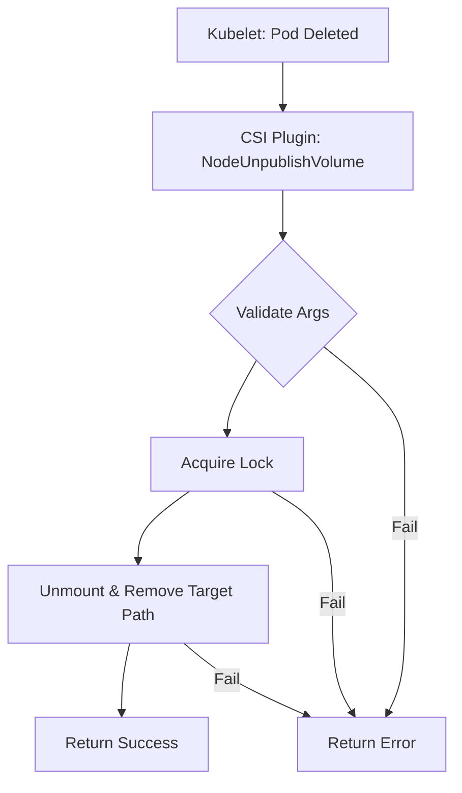

[Sourced from: pkg/gce-pd-csi-driver/node.go](file:///usr/local/google/home/jaimebz/oss/gcp-compute-persistent-disk-csi-driver/pkg/gce-pd-csi-driver/node.go)

# CSI NodeUnpublishVolume

## RPC Definition

```protobuf
rpc NodeUnpublishVolume (NodeUnpublishVolumeRequest) returns (NodeUnpublishVolumeResponse) {}
```

## Purpose

This operation is called by the Kubelet to unmount a volume from a Pod's `target_path`. This reverses the actions of `NodePublishVolume`.

*   **Trigger:** When a Pod using the volume is terminated.
*   **Action:** Unmounts the volume from the Pod's `target_path`.

## Parameters

*   `volume_id`: The ID of the volume. (Required)
*   `target_path`: The path within the Pod where the volume is mounted. (Required)

## Key Logic Flow

1.  **Validate Arguments:** Checks for `volume_id` and `target_path`.
2.  **Acquire Lock:** Locks the `volume_id`.
3.  **Cleanup Publish Path:** Unmounts and removes the `target_path` using `cleanupPublishPath`.
4.  **Return Response:** Returns an empty `NodeUnpublishVolumeResponse` on success.



## Error Handling

*   `InvalidArgument`: Missing or invalid arguments.
*   `Aborted`: Volume lock could not be acquired.
*   `Internal`: Unmounting or path removal failed.

## Return Values

*   `NodeUnpublishVolumeResponse`: An empty response indicating success.

---

[← README.md](./README.md)
