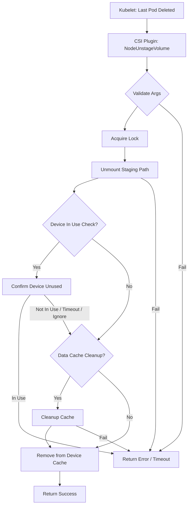

[Sourced from: pkg/gce-pd-csi-driver/node.go](file:///usr/local/google/home/jaimebz/oss/gcp-compute-persistent-disk-csi-driver/pkg/gce-pd-csi-driver/node.go)

# CSI NodeUnstageVolume

## RPC Definition

```protobuf
rpc NodeUnstageVolume (NodeUnstageVolumeRequest) returns (NodeUnstageVolumeResponse) {}
```

## Purpose

This operation is called by the Kubelet to unmount a volume from its staging path on the node. This reverses the actions of `NodeStageVolume`.

*   **Trigger:** When the last Pod using the volume on the node is terminated.
*   **Action:** Unmounts the volume from the `staging_target_path` and cleans up any data cache.

## Parameters

*   `volume_id`: The ID of the volume to unstage. (Required)
*   `staging_target_path`: The directory on the node where the volume is staged. (Required)

## Key Logic Flow

1.  **Validate Arguments:** Checks for `volume_id` and `staging_target_path`.
2.  **Acquire Lock:** Locks the `volume_id` to prevent concurrent operations.
3.  **Cleanup Stage Path:** Unmounts the volume from the `staging_target_path` using `cleanupStagePath`.
4.  **Device In Use Check:** If `enableDeviceInUseCheck` is true, verifies the underlying block device is no longer in use using `confirmDeviceUnused`. Handles errors and timeouts.
5.  **Data Cache Cleanup:** If data caching is enabled, cleans up the cache setup for the volume using `cleanupCache`.
6.  **Device Cache Removal:** Removes the volume from the in-memory device path cache.
7.  **Return Response:** Returns an empty `NodeUnstageVolumeResponse` on success.



## Error Handling

*   `InvalidArgument`: Missing or invalid arguments.
*   `Aborted`: Volume lock could not be acquired.
*   `Internal`: Unmounting failed, device still in use after timeout.
*   `DataLoss`: Data cache cleanup errors.

## Return Values

*   `NodeUnstageVolumeResponse`: An empty response indicating success.

---

[← README.md](./README.md)
